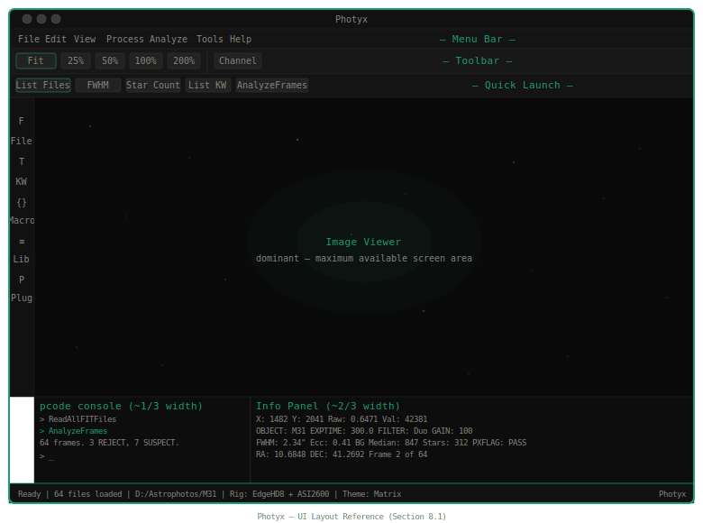

# Photyx — Specification & Requirements Document

**Version:** 16
**Date:** 23 April 2026 6:42am
**Status:** Active Development — Phase 4 complete, Phase 5 starting

---

## 1. Overview

Photyx is a high-performance desktop application for reading, viewing, processing, and analyzing astrophotography image files. It is designed for astrophotographers and researchers who require fast image review, batch processing, keyword management, quantitative analysis, and scriptable automation — all within a single, extensible platform.

---

## 2. Goals & Design Philosophy

- **Speed first.** Image loading, blinking, and rendering must feel instantaneous. The entire pipeline from disk to display is optimized at every layer.
- **Extensible by design.** All functionality — including core I/O and processing — is implemented as plugins, enabling both curated built-in capability and user-authored extensions.
- **Scriptable and automatable.** A purpose-built macro language (pcode) allows users to define and save reusable macros, which can also be triggered from external programs or the command line.
- **Cross-platform.** The application targets Windows, macOS, and Linux from day one.
- **Open architecture.** Analysis functionality, file format support, and processing operations are all designed as discrete, independently testable modules.

---

## 3. Target Platforms

| Platform | Minimum Version |
|---|---|
| Windows | Windows 10 (64-bit) |
| macOS | macOS 12 Monterey |
| Linux | Ubuntu 22.04 LTS or equivalent |

The application will be distributed as a native installable package on each platform (.msi / .exe on Windows, .dmg on macOS, .AppImage or .deb on Linux).

---

## 4. Technology Stack

### 4.1 Frontend (UI)

- **Framework:** Tauri (v2)
- **UI Component Framework:** Svelte
- **UI Language:** HTML, CSS, Svelte components
- **Rendering:** OS-native WebView (no bundled Chromium)

The frontend is responsible for all user-facing panels: file browser, image viewer, blink controller, macro editor, keyword editor, console, and analysis results display. Svelte's reactive model is used for all state synchronization between panels.

### 4.2 Backend (Core Engine)

- **Language:** Rust
- **Concurrency:** Rayon (data-parallel processing across CPU cores)
- **IPC:** Tauri command system (frontend ↔ backend)
- **REST API:** Axum (local HTTP server for external program and CLI access)
- **Image buffer management:** Custom pool with memory mapping for large files
- **Logging:** Rust `tracing` crate; structured log written to OS app data directory

### 4.3 Key Rust Crates (Planned)

| Crate | Purpose |
|---|---|
| `fitsio` | FITS file reading/writing (wraps cfitsio) |
| `tiff` | TIFF file reading/writing |
| `image` | PNG, JPEG encoding/decoding |
| `rayon` | Parallel batch processing |
| `axum` | REST API server |
| `notify` | File system watching |
| `fast_image_resize` | SIMD-accelerated thumbnail generation |
| `wasmtime` | WASM runtime for user plugins |
| `tracing` | Structured application logging |
| `serde` / `serde_json` | Plugin manifests, config, API payloads |

### 4.4 Key Tauri Plugins (Planned)

| Plugin | Purpose |
|---|---|
| `tauri-plugin-store` | Persistent key/value settings storage |
| `tauri-plugin-updater` | Application update mechanism |

### 4.5 XISF Support

XISF (Extensible Image Serialization Format) is a priority format. The dedicated `photyx-xisf` crate has been implemented and is substantially complete. It is:

- Self-contained and independently versioned, licensed MIT OR Apache-2.0
- Fully tested with a suite of reference XISF files including uncompressed and LZ4HC compressed variants
- Capable of handling compressed payloads (LZ4, LZ4HC, zstd, zlib) with byte-shuffling
- Capable of reading and writing both the XISF Properties block and the FITSKeyword block
- Optimized using zero-copy byte casting (`bytemuck`) for pixel deserialization — reduces 38-second read time to under 1 second for 9-megapixel files
- Supports UInt8, UInt16, UInt32, Float32, Float64 pixel formats and Grayscale, RGB, CFA color spaces

**Known limitations of current implementation:** Vector and Matrix XISF Properties (used for astrometric solution matrices) are read as placeholder strings and not written. All other property types round-trip correctly. This limitation is deferred pending test files containing these property types.

### 4.6 File Type Filter

The File Browser panel includes a format filter dropdown that controls which file types are loaded when the user clicks the Load button. The filter options are:

| Filter Label | Extensions |
|---|---|
| All Supported (default) | *.fit, *.fits, *.fts, *.xisf, *.tif, *.tiff, *.png, *.jpg, *.jpeg |
| FITS only | *.fit, *.fits, *.fts |
| XISF only | *.xisf |
| TIFF only | *.tif, *.tiff |
| PNG only | *.png |
| JPEG only | *.jpg, *.jpeg |

The selected filter determines which read plugin(s) are invoked when the Load button is clicked. The filter selection is persisted across sessions via the settings store.

When invoked from pcode rather than the UI, format selection is controlled by which read command is used (`ReadAllFITFiles`, `ReadAllXISFFiles`, etc.).

---

## 5. Supported File Formats

### 5.1 Plugin-Based Format Architecture

Every file format reader and writer is a discrete plugin module. Adding support for a new format — such as animated GIF, RAW camera formats, or video formats — requires only authoring a new plugin that conforms to the standard plugin interface. No changes to core application code are required. The formats listed below represent the initial set of built-in format plugins, not a closed list.

### 5.2 Read Support (Initial)

| Format | Notes |
|---|---|
| FITS (.fit, .fits, .fts) | Via `fitsio` / cfitsio |
| XISF (.xisf) | Via custom `photyx-xisf` crate |
| TIFF (.tif, .tiff) | Including 8-bit, 16-bit, and 32-bit float variants |
| PNG (.png) | Supported for viewing and format conversion purposes only; keyword import not applicable |
| JPEG (.jpg, .jpeg) | Supported for viewing and format conversion purposes only; keyword import not applicable; lossy 8-bit format |

### 5.3 Write Support (Initial)

| Format | Notes |
|---|---|
| FITS (.fit, .fits) | Full keyword support |
| XISF (.xisf) | Full keyword support; dual-write to FITSKeyword block and Properties block |
| TIFF (.tif, .tiff) | AstroTIFF keyword conventions supported |
| PNG (.png) | 16-bit support |
| JPEG (.jpg) | 8-bit, quality-configurable; default quality 75% |

### 5.4 AstroTIFF Keyword Convention

TIFF files written by Photyx embed keywords using FITS-style NAME = VALUE / comment formatting, stored in a custom TIFF tag or the ImageDescription field. This convention keeps keyword semantics consistent across FITS, XISF, and TIFF within Photyx. The convention is fully documented within this specification and is intended to serve as a reproducible standard for Photyx-generated TIFF files.

### 5.5 Bit Depth & Color Space

- Supported bit depths: 8-bit integer, 16-bit integer, 32-bit float
- Supported color modes: Monochrome (single channel), RGB (three channel)
- The internal image buffer always stores channel count, bit depth, and color space metadata

### 5.6 Format Conversion

Format conversion is a first-class supported workflow in Photyx. Converting from one format to another is implemented as a read plugin followed by a write plugin with no special conversion layer required. This means any readable format can be converted to any writable format using a simple pcode macro.

**Keyword fidelity is a hard requirement.** All keywords present in the source file must be preserved in the output file to the extent the target format supports them. Where format keyword conventions differ, a keyword mapping and translation layer handles the conversion. Any keyword that cannot be represented in the target format is logged as a warning — nothing is silently dropped.

**FITS to XISF dual-write strategy.** When converting a FITS file to XISF, all FITS keywords are written verbatim into the FITSKeyword block in the XISF header. Any keyword with a known XISF Property equivalent is additionally written into the Properties block. Keywords not in the mapping table are preserved verbatim in the FITSKeyword block — nothing is lost.

Example pcode macro for format conversion:

```
# Convert all TIFF files in a directory to FITS
SelectDirectory path="D:/Astrophotos/M31"
ReadAllTIFFFiles
WriteAllFITFiles destination="D:/Output"
```

### 5.7 Debayering (OSC Camera Support)

Many astrophotos are captured with one-shot color (OSC) cameras that use a Bayer color filter array (CFA). Raw files from these cameras contain a single-channel image with a Bayer mosaic pattern.

Photyx detects the presence of a Bayer pattern by checking for the BAYERPAT keyword (or equivalent) in the file header on load. CFA files are loaded and displayed as mono by default — no automatic debayering is performed. Debayering is available on demand via the `DebayerImage` plugin command.

| File Type | Channels | Action |
|---|---|---|
| Mono camera raw | 1 (grayscale) | None — display as mono |
| OSC camera raw (Bayer) | 1 (CFA pattern) | Display as mono by default; debayer on demand via DebayerImage |
| Pre-debayered color | 3 (RGB) | None — display as RGB |
| Narrowband (Ha, OIII, etc.) | 1 per filter | None — display as mono per channel |

Debayering is handled by the `DebayerImage` built-in native plugin. The following algorithms are supported:

| Algorithm | Speed | Quality | Notes |
|---|---|---|---|
| Nearest Neighbor | Fastest | Lowest | Quick preview only |
| Bilinear | Fast | Moderate | Default |
| VNG (Variable Number of Gradients) | Moderate | Good | Better for detailed review |
| AHD (Adaptive Homogeneity-Directed) | Slower | Highest | Best quality; recommended for production |

Bilinear interpolation is the default. The algorithm is user-configurable and exposed as a pcode argument.

### 5.8 FITS to XISF Keyword Mapping

XISF stores metadata in two ways within its XML header block:

- **XISF Properties** — native typed metadata using a dot-notation namespace hierarchy (e.g., `Instrument:Filter:Name`)
- **FITSKeyword block** — verbatim FITS-style keyword/value pairs preserved exactly as they appear in the source file

When converting FITS to XISF, Photyx writes all FITS keywords into the FITSKeyword block verbatim, and additionally writes any keyword with a known XISF Property equivalent into the Properties block. This ensures maximum compatibility with other XISF-aware tools.

Example — `FILTER=duo` in a converted XISF file:

```xml
<FITSKeyword name="FILTER" value="duo" comment=""/>
<Property id="Instrument:Filter:Name" type="String" value="duo"/>
```

The following table defines the initial FITS-to-XISF property mapping. This list is not closed and additional mappings can be added as the XISF standard evolves:

| FITS Keyword | XISF Property |
|---|---|
| OBJECT | Observation:Object:Name |
| TELESCOP | Instrument:Telescope:Name |
| INSTRUME | Instrument:Camera:Name |
| EXPTIME | Observation:Time:ExposureTime |
| FILTER | Instrument:Filter:Name |
| GAIN | Instrument:Camera:Gain |
| TEMP | Instrument:Camera:Temperature |
| DATE-OBS | Observation:Time:Start |
| RA | Observation:Object:RA |
| DEC | Observation:Object:Dec |
| CRVAL1 | Observation:Center:RA |
| CRVAL2 | Observation:Center:Dec |
| RADESYS | Observation:CelestialReferenceSystem |
| EQUINOX | Observation:Equinox |
| SITELAT | Observation:Location:Latitude |
| SITELONG | Observation:Location:Longitude |
| SITEELEV | Observation:Location:Elevation |
| XBINNING | Instrument:Camera:XBinning |
| YBINNING | Instrument:Camera:YBinning |
| FOCALLEN | Instrument:Telescope:FocalLength |
| IMAGETYP | Observation:Image:Type |

> **Note on WCS transformation keywords.** `CRPIX1`, `CRPIX2`, `CD1_1`, `CD1_2`, `CD2_1`, `CD2_2`,
> `PC1_1`, `PC1_2`, `PC2_1`, `PC2_2`, `CROTA1`, `CROTA2`, `CDELT1`, `CDELT2`, `LONPOLE`,
> `LATPOLE`, and `PV1_*` have no direct XISF Property equivalents. These are preserved
> verbatim in the FITSKeyword block and are not mapped to the Properties block.

> **Note on RA/DEC vs. CRVAL1/CRVAL2.** `RA` and `DEC` are the telescope's nominal pointing
> target coordinates — where the mount was commanded to point. `CRVAL1` and `CRVAL2` are the
> plate-solved sky coordinates of the WCS reference pixel, representing the actual image center
> as determined by astrometric solution. Both pairs are preserved as distinct XISF Properties.

---

## 6. Plugin Architecture

### 6.1 Philosophy

Every discrete operation in Photyx is a plugin. This applies to file readers, file writers, keyword operations, processing steps, stretch algorithms, and analysis functions. The core engine is a plugin host; it contains no hard-coded operations.

Additional processing, analysis, and format capabilities can be added at any time via the plugin framework, either as curated built-in plugins or user-installed plugins.

### 6.2 Plugin Loading Model — Hybrid Architecture

Photyx uses a hybrid plugin loading model:

- **Built-in plugins** are compiled natively into the application binary. They have maximum performance, full access to internal data structures, and are version-locked with the core engine. These are used for all performance-critical and foundational operations.
- **User plugins** are loaded as WASM (WebAssembly) modules via an embedded Wasmtime runtime. They are sandboxed, cross-platform (one `.wasm` file runs on Windows, macOS, and Linux without recompilation), and cannot destabilize the host application. These are used for user-authored extensions and third-party analysis modules.

This boundary can be adjusted per plugin type as the system matures. The interface between the plugin host and all plugins is identical regardless of loading mechanism.

### 6.3 Plugin Designation Table

The following table explicitly designates the loading mechanism for each plugin in the initial release:

| Plugin | Category | Type |
|---|---|---|
| ReadFITS | I/O Reader | Built-in Native |
| ReadXISF | I/O Reader | Built-in Native |
| ReadTIFF | I/O Reader | Built-in Native |
| ReadPNG | I/O Reader | Built-in Native |
| ReadJPEG | I/O Reader | Built-in Native |
| WriteFITS | I/O Writer | Built-in Native |
| WriteXISF | I/O Writer | Built-in Native |
| WriteTIFF | I/O Writer | Built-in Native |
| WritePNG | I/O Writer | Built-in Native |
| WriteJPEG | I/O Writer | Built-in Native |
| AddKeyword | Keyword | Built-in Native |
| DeleteKeyword | Keyword | Built-in Native |
| ModifyKeyword | Keyword | Built-in Native |
| CopyKeyword | Keyword | Built-in Native |
| ListKeywords | Keyword | Built-in Native |
| SelectDirectory | File Management | Built-in Native |
| ListFiles | File Management | Built-in Native |
| FilterByKeyword | File Management | Built-in Native |
| BlinkSequence | Blink & View | Built-in Native |
| CacheFrames | Blink & View | Built-in Native |
| SetZoom | Blink & View | Built-in Native |
| AutoStretch | Processing | Built-in Native |
| GetHistogram | Processing | Built-in Native |
| CropImage | Processing | Built-in Native |
| BinImage | Processing | Built-in Native |
| DebayerImage | Processing | Built-in Native |
| AnalyzeFrames | Frame Analysis | Built-in Native |
| GetImageProperty | Interrogation | Built-in Native |
| GetKeyword | Interrogation | Built-in Native |
| GetSessionProperty | Interrogation | Built-in Native |
| Test | Interrogation | Built-in Native |
| pcode Interpreter | Scripting | Built-in Native |
| RunMacro | Scripting | Built-in Native |
| DefineMacro | Scripting | Built-in Native |
| ComputeFWHM | Analysis | WASM |
| CountStars | Analysis | WASM |
| ComputeEccentricity | Analysis | WASM |
| MedianValue | Analysis | WASM |
| ContourPlot (FWHM) | Analysis | WASM |

Analysis plugins are implemented initially as WASM modules to serve as a benchmark baseline. Once the system is stable, native built-in equivalents will be developed and benchmarked against the WASM versions. Benchmark results will inform the long-term policy for which analysis plugins are promoted to built-in native.

### 6.4 Plugin Interface (Rust Trait)

All plugins implement the following trait:

```rust
pub trait PhotonPlugin: Send + Sync {
    fn name(&self) -> &str;
    fn version(&self) -> &str;
    fn description(&self) -> &str;
    fn parameters(&self) -> Vec<ParamSpec>;
    fn execute(
        &self,
        ctx: &mut AppContext,
        args: &ArgMap,
    ) -> Result<PluginOutput, PluginError>;
}
```

The `AppContext` carries the current image buffer pool, keyword store, active file list, and session state. The `parameters()` method returns a machine-readable parameter specification that the UI uses to auto-generate controls in the macro editor and plugin panels.

### 6.5 Plugin Settings

Each plugin may define its own persistent settings via a standard plugin settings API. Settings are stored in the application settings store under a namespace keyed to the plugin name. This allows each plugin to independently persist user preferences (e.g., default debayer algorithm, default stretch parameters) across sessions without any changes to the core settings system.

### 6.6 Plugin Distribution

- A curated set of built-in plugins ships with the application
- Users may install additional WASM plugins by placing them in a designated plugins directory
- Each plugin ships with a manifest file (TOML) describing name, version, author, parameters, and dependencies
- Future consideration: a plugin repository / package manager

---

## 7. Macros — pcode

### 7.1 Overview

pcode is a purpose-built, line-oriented macro language. Each line is a command consisting of a command name followed by zero or more named arguments. Macros can be written in the built-in macro editor, saved as named `.phs` files, and executed interactively via the console, via the REST API, or from the command line.

### 7.2 Syntax

```
# This is a comment
Set input="D:/Astrophotos/M31"
Set output="D:/Output"
SelectDirectory path=$input
ReadAllFITFiles
AutoStretch method=autostf shadowclip=-2.8 targetbackground=0.25
AddKeyword name=TELESCOP value="Celestron EdgeHD 8"
DeleteKeyword name=EXPTIME
ModifyKeyword name=OBJECT value="M31 Andromeda"
WriteAllFITFiles destination=$output overwrite=false
```

### 7.3 Language Features

- Single-line commands: `CommandName arg=value arg2="string value"`
- Comments: lines beginning with `#`
- Named macros: reusable blocks saved as `.phs` files
- Arguments: typed (string, integer, float, boolean, path)
- Variables: declared and assigned with `Set`
- Arithmetic operators: `+`, `-`, `*`, `/`, `^` (exponentiation)
- Grouping: parentheses `( )` for expression precedence
- Math functions: `sqrt()`, `abs()`, `round()`, `floor()`, `ceil()`, `min()`, `max()`
- Conditional logic: If / ElseIf / Else / EndIf
- Loops: For / EndFor and ForEach / EndForEach
- Error handling: commands return success/failure; macros can halt on error or continue

### 7.4 Control Flow Syntax

```
# Variables
Set myVar = 42
Set name = "M31"

# Arithmetic
Set mean = $sum / $count
Set variance = ($sumSq / $count) - ($mean ^ 2)
Set sd = sqrt($variance)
Set bounded = max($value, 0.01)

# Conditional
If $frameCount > 10
    AutoStretch method=autostf
ElseIf $frameCount > 5
    Print "Few frames — proceeding anyway"
Else
    Print "Too few frames"
EndIf

# Count-based loop
For i = 1 To 10
    Print "Frame $i"
EndFor

# Collection loop
ForEach file In FileList
    AddKeyword name=OBJECT value="M31"
EndForEach

# Early exit
Break
Continue
```

### 7.5 Expressions

```
# Comparison
If $frameCount > 10
If $filename Contains "light"
If $keyword.EXPTIME == 300
If $keyword.OBJECT != "M31"
If $Width >= 4000 And $Height >= 3000

# Arithmetic in expressions
If ($fwhm - $meanFwhm) / $sdFwhm > 2.5
Set ratio = $signal / max($noise, 0.001)
Set result = sqrt(($x - $cx) ^ 2 + ($y - $cy) ^ 2)
```

### 7.6 Interpreter Design

The pcode interpreter is implemented in Rust as a built-in native component of the core engine:

1. **Tokenizer** — splits each line into command name and named argument pairs
2. **Dispatcher** — looks up the command name in the plugin registry
3. **Executor** — calls `plugin.execute(ctx, args)` and handles the result
4. **Reporter** — collects results for display in the UI or API response

> **Note on async execution (Phase 5).** Long-running plugin executions should use Tauri's event emission model rather than blocking invoke/response. The dispatcher should return immediately with a command ID, and the plugin emits a completion event when done. This keeps the frontend fully responsive during execution. Currently, long-running commands block the JavaScript event loop. Implementation deferred to Phase 5.

### 7.7 Saved Macros

Users can define and save named macros as `.phs` files (Photyx Host Script). Macros appear in the UI as reusable operations and are callable from other macros. Arguments are passed positionally ($1, $2, ...) or by name, making user macros indistinguishable from built-in commands in the console and macro editor:

```
DefineMacro ProcessLightFrames
    SelectDirectory path=$1
    ReadAllFITFiles
    DebayerImage method=bilinear
    AutoStretch method=autostf
    WriteAllFITFiles destination=$2
EndMacro
```

Called as:

```
ProcessLightFrames path="D:/Lights" destination="D:/Output"
```

### 7.8 pcode Data Dictionary

The following table defines all pcode commands in the initial release. Arguments shown in brackets are optional.

| Command | Category | Description | Key Arguments |
|---|---|---|---|
| SelectDirectory | File Management | Sets the active working directory | path |
| ReadAllFITFiles | I/O | Reads all FITS files in the active directory into the buffer pool | — |
| ReadAllXISFFiles | I/O | Reads all XISF files in the active directory | — |
| ReadAllTIFFFiles | I/O | Reads all TIFF files in the active directory | — |
| ReadAllFiles | I/O | Reads all supported image files (FITS + XISF + TIFF) in the active directory | — |
| WriteAllFITFiles | I/O | Writes all buffered images as FITS files | destination, [overwrite] |
| WriteAllXISFFiles | I/O | Writes all buffered images as XISF files | destination, [overwrite] |
| WriteAllTIFFFiles | I/O | Writes all buffered images as TIFF files | destination, [overwrite] |
| WriteCurrentFiles | I/O | Writes all buffered images back to their source paths in their original format | — |
| WritePNG | I/O | Writes a single image as PNG | filename, destination |
| WriteJPEG | I/O | Writes a single image as JPEG | filename, destination, [quality] |
| ListFiles | File Management | Lists files in the active directory | [filter] |
| FilterByKeyword | File Management | Filters the active file list by keyword value | name, value |
| AddKeyword | Keyword | Adds a keyword to all buffered images | name, value, [comment] |
| DeleteKeyword | Keyword | Removes a keyword from all buffered images | name |
| ModifyKeyword | Keyword | Changes the value of an existing keyword | name, value, [comment] |
| CopyKeyword | Keyword | Copies a keyword value to a new keyword name | from, to |
| ListKeywords | Keyword | Lists all keywords for the current image | — |
| GetKeyword | Interrogation | Retrieves a keyword value into a variable; see Section 7.12 for full keyword list | name |
| GetImageProperty | Interrogation | Retrieves an image property into a variable; see Section 7.12 for full property list | property |
| GetSessionProperty | Interrogation | Retrieves a session state value into a variable; see Section 7.12 for full property list | property |
| Test | Interrogation | Performs a boolean test and stores result in $Result; see Section 7.12 for full test list | expression |
| AutoStretch | Processing | Applies automatic screen transfer function stretch (display only — raw buffer unchanged) | [method], [shadowClip], [targetBackground] |
| GetHistogram | Processing | Computes histogram statistics for the current frame (median, std dev, clipping %) | — |
| CropImage | Processing | Crops the image to a specified region | x, y, width, height |
| BinImage | Processing | Bins the image by an integer factor | factor |
| DebayerImage | Processing | Debayers a Bayer CFA image on demand | [pattern], [method] |
| AnalyzeFrames | Frame Analysis | Computes per-frame quality metrics for all loaded frames, classifies each as PASS / SUSPECT / REJECT, and writes PXFLAG keyword to each file; uses active rig profile thresholds | [profile] |
| BlinkSequence | Blink & View | Starts blinking the loaded image set | [fps] |
| CacheFrames | Blink & View | Pre-decodes and caches all frames for blinking | — |
| SetZoom | Blink & View | Sets the viewer zoom level | level (fit, 25, 50, 100, 200) |
| ComputeFWHM | Analysis | Calculates Full Width at Half Maximum for detected stars | — |
| CountStars | Analysis | Counts detected stars in the image | — |
| ComputeEccentricity | Analysis | Calculates eccentricity for detected stars | — |
| MedianValue | Analysis | Returns the median pixel value per channel | — |
| ContourPlot (FWHM) | Analysis | Generates a 2D contour map for FWHM star analysis output | [x], [y], [radius] |
| Set | Scripting | Assigns a value to a variable | varname, value |
| Print | Scripting | Outputs a message to the pcode console | message |
| Echo | Scripting | Prints the current value of a variable | varname |
| Assert | Scripting | Halts execution with an error if expression is false | expression |
| CountFiles | Scripting | Returns the number of files in the current list | — |
| RunMacro | Scripting | Executes a saved .phs macro file | filename |
| DefineMacro | Scripting | Begins the definition of a named reusable macro; supports positional ($1, $2) and named arguments | name |
| Log | Scripting | Writes collected macro output to a file | path, [append] |
| pwd | Console | Prints the current active directory to the console (client-side only) | — |

### 7.9 Interactive Console

The interactive console provides a REPL-style interface for entering and executing pcode commands one at a time without creating a macro file. It occupies approximately one-third of the bottom panel width and is always visible.

**Features:**

- Single input line with `>` prompt
- Command output (results, info, errors) routes to the notification bar and notification history
- Up/down arrow key navigation through command history
- Tab completion for command names and argument names

**Copy to Editor:** A "Copy to Editor" button captures the current console session history and pastes it into the macro editor as a new macro, allowing users to discover a workflow interactively and then formalize it as a saved macro.

**Implementation note:** The console uses the identical IPC path as the macro editor — each command entered calls the same plugin dispatcher in the Rust backend. No backend changes are required to support the console.

### 7.10 Macro Library

The Macro Library is a designated directory that Photyx scans on startup. Any `.phs` file found in this directory is automatically registered as an available command, indistinguishable from built-in commands in terms of how they are called.

Registered macros:
- Appear in tab completion in the console
- Appear in the macro editor command list
- Are accessible in a dedicated Macro Library sliding panel in the UI
- Can be called from other macros using `RunMacro`

This creates a three-tier command model:

```
Tier 1: Built-in Native plugins   — ReadFITS, AutoStretch, AnalyzeFrames, etc.
Tier 2: WASM plugins              — ComputeFWHM, CountStars, etc.
Tier 3: User Macros (.phs files)  — ProcessLightFrames, etc.
```

All three tiers are callable identically from the console, macro editor, and REST API.

### 7.11 Path Conventions

All paths in pcode commands and macros follow these conventions regardless of the host operating system:

- **Forward slash universal.** All paths use forward slashes exclusively (`/`). The Rust backend silently translates to the OS-native path separator before any filesystem call. Users never write or see backslashes on any platform.
- **Absolute paths.** Fully qualified from the drive root on Windows (`D:/Astrophotos/M31`) or filesystem root on macOS and Linux (`/home/user/Astrophotos/M31`).
- **Relative paths.** Resolved relative to the current active directory as set by `SelectDirectory`. A relative path in a macro resolves against whatever the active directory is at the time the macro executes, not the macro file's own location.
- **Home directory shorthand.** The `~` character expands to the current user's home directory on all platforms (e.g., `~/Astrophotos/M31`).
- **UNC paths.** Supported using double forward slash notation for accessing remote network devices (e.g., `//192.168.1.100/Astrophotos/M31`). Useful for accessing remote devices such as ASIAir Pro folders over a local network.
- **Paths containing spaces.** Must be enclosed in double quotes. Unquoted paths may not contain spaces.

Examples:

```
# Absolute path
SelectDirectory path="D:/Astrophotos/M31"

# Relative path (resolved against active directory)
WriteAllFITFiles destination="Output/Processed"

# Home directory shorthand
SelectDirectory path="~/Astrophotos/M31"

# UNC path (e.g. ASIAir Pro over local network)
SelectDirectory path="//192.168.1.100/Astrophotos/M31"

# Path with spaces — must be quoted
SelectDirectory path="D:/My Astrophotos/M31"
```

### 7.12 Interrogation Properties

The following tables define all properties and tests available through the interrogation command family. This list represents the initial set; additional properties can be added as plugins without changing the core interrogation mechanism.

#### Image Properties (GetImageProperty)

| Property | Type | Description | Example Value |
|---|---|---|---|
| Width | Integer | Image width in pixels | 4656 |
| Height | Integer | Image height in pixels | 3520 |
| Channels | Integer | Number of color channels | 1 (mono), 3 (RGB) |
| BitDepth | Integer | Bits per pixel per channel | 8, 16, 32 |
| DataType | String | Pixel data type | UInt16, Float32 |
| ColorSpace | String | Color space of the image | Mono, RGB, Bayer |
| BayerPattern | String | Bayer filter pattern if present | RGGB, BGGR, GRBG, GBRG |
| FileFormat | String | Source file format | FITS, XISF, TIFF, PNG, JPEG |
| Filename | String | Full path of the source file | //192.168.1.100/M31/frame001.fit |
| FileSize | Integer | File size in bytes | 32440320 |
| ImageIndex | Integer | Index of image in current file list | 0-based |
| IsDebayered | Boolean | Whether debayering has been applied | true, false |
| HasKeywords | Boolean | Whether the file contains header keywords | true, false |
| Compression | String | Compression algorithm if applicable | LZ4, zstd, zlib, None |
| ByteOrder | String | Byte order of pixel data | BigEndian, LittleEndian |

#### Keyword Properties (GetKeyword)

Any keyword present in the file header can be retrieved by name using `GetKeyword name=X`. The following table lists common astrophotography keywords; this is not a closed list.

| Keyword | Type | Description | Example Value |
|---|---|---|---|
| OBJECT | String | Target object name | M31 |
| TELESCOP | String | Telescope name | Celestron EdgeHD 8 |
| INSTRUME | String | Camera/instrument name | ZWO ASI2600MC |
| EXPTIME | Float | Exposure time in seconds | 300.0 |
| GAIN | Integer | Camera gain setting | 100 |
| OFFSET | Integer | Camera offset setting | 30 |
| TEMP | Float | Sensor temperature in Celsius | -10.0 |
| FILTER | String | Filter name | Ha, OIII, Lum, duo |
| BAYERPAT | String | Bayer pattern from capture software | RGGB |
| XBINNING | Integer | Horizontal binning factor | 1 |
| YBINNING | Integer | Vertical binning factor | 1 |
| FOCALLEN | Float | Focal length in mm | 2032.0 |
| APERTURE | Float | Aperture in mm | 203.2 |
| RA | Float | Right ascension of target in degrees | 10.6848 |
| DEC | Float | Declination of target in degrees | 41.2692 |
| DATE-OBS | String | Date and time of observation (UTC) | 2024-11-15T22:30:00 |
| SITELONG | Float | Observatory longitude | -105.1786 |
| SITELAT | Float | Observatory latitude | 40.5853 |
| SITEELEV | Float | Observatory elevation in meters | 1524.0 |
| IMAGETYP | String | Frame type | Light, Dark, Flat, Bias |
| SWCREATE | String | Software that created the file | Photyx 1.0 |
| PXFLAG | String | Photyx frame analysis recommendation | PASS, SUSPECT, REJECT |

#### Session Properties (GetSessionProperty)

| Property | Type | Description | Example Value |
|---|---|---|---|
| FileCount | Integer | Number of files in the active file list | 47 |
| ActiveDirectory | String | Current active working directory | D:/Astrophotos/M31 |
| CurrentFrame | Integer | Index of the currently displayed frame | 0-based |
| LoadedFileCount | Integer | Number of files loaded into buffer pool | 12 |
| TotalMemoryUsed | Integer | Buffer pool memory usage in bytes | 1073741824 |
| Platform | String | Current OS platform | Windows, macOS, Linux |
| PhotoyxVersion | String | Running version of Photyx | 1.0.0 |

#### Boolean Tests (Test)

| Test Expression | Description | Result |
|---|---|---|
| ImageHasBayerPattern | True if a Bayer pattern is detected | true, false |
| ImageIsColor | True if image has 3 channels | true, false |
| ImageIsMono | True if image has 1 channel | true, false |
| ImageIsDebayered | True if debayering has been applied | true, false |
| KeywordExists name=X | True if the named keyword is present | true, false |
| FileCountExceeds count=X | True if file list exceeds X files | true, false |
| DirectoryExists path=X | True if the specified path exists | true, false |
| FileExists path=X | True if the specified file exists | true, false |
| VariableIsSet name=X | True if the named variable has been assigned | true, false |

---

## 8. User Interface

### 8.1 Overall Layout

The Photyx UI is organized as a single main window with a fixed chrome (menu bar, toolbar, notification bar) surrounding a flexible content area. The image viewer is the dominant element and receives the maximum available screen real estate.



The layout from top to bottom:
- **Title bar** — window controls
- **Menu bar** — File, Edit, View, Process, Analyze, Tools, Help
- **Toolbar** — Auto-STF toggle, zoom controls, channel selector
- **Quick Launch panel** — one-click macro buttons, collapsible
- **Content area** — icon sidebar (left edge) + image viewer (dominant)
- **Bottom strip** — pcode console (~1/3 width) | Info Panel (~2/3 width)
- **Notification / Status bar** — full width, single line, flush to bottom

### 8.2 Menu Bar

| Menu | Items |
|---|---|
| File | Select Directory, Close, Exit |
| Edit | Keywords, Preferences |
| View | Stretch, Theme, Panel Toggles |
| Process | Run Macro, Macro Library |
| Analyze | FWHM, Star Count, Eccentricity, Median Value, Contour Plot |
| Tools | Settings, Plugin Manager, Log Viewer |
| Help | About, Documentation, Check for Updates |

### 8.3 Toolbar

The toolbar contains an Auto-STF toggle button (first button on the left), zoom controls, and channel controls. The Auto-STF toggle button enables or disables automatic stretch when a frame is displayed — when enabled, Auto-STF is applied automatically; when disabled, images are displayed without stretch. Additional controls will be added in future releases. The toolbar is not user-configurable in v1.0.

### 8.4 Quick Launch Panel

A panel of buttons providing one-click access to frequently used commands. The default buttons are:

| Button | Command |
|---|---|
| List Files | ListFiles |
| FWHM | ComputeFWHM |
| Star Count | CountStars |
| List KW | Opens keyword modal dialog |

- List KW opens a modal dialog showing all FITS/XISF keywords for the current frame with search filtering
- User configurable — additional macros can be added
- Can be collapsed to save vertical space

### 8.5 Icon Sidebar

A narrow vertical bar on the left edge of the content area. Each icon toggles a sliding panel open or closed. Panels slide in over the image viewer from the left or right.

| Icon | Panel |
|---|---|
| Folder | File Browser |
| Tag | Keyword Editor |
| Code | Macro Editor |
| List | Macro Library |
| Puzzle | Plugin Manager |

### 8.6 Sliding Panels

#### File Browser
- Flat file list displaying files loaded into the current session
- Directory path bar at the top showing the current active directory with a browse button (triggers SelectDirectory — sets the directory and populates the file list with all files of supported formats, but does not load pixel data)
- Format filter dropdown: All Supported / FITS only / XISF only / TIFF only / PNG only / JPEG only (default: All Supported; persisted across sessions)
- Load button: reads pixel data for all files matching the current format filter via the appropriate read plugin(s)
- Clicking a file in the list displays it in the viewer (triggers AutoStretch if no display cache entry exists)
- Supports multi-select for batch operations
- File list updates automatically when the active directory changes via pcode or UI

#### Keyword Editor
- Displays all header keywords for the currently viewed image
- Inline editing of keyword values
- Add and delete keyword buttons
- Changes are applied immediately and reflected in the image buffer

#### Macro Editor
- Full-featured text editor for writing pcode macros
- Syntax highlighting for pcode commands, arguments, comments, and variables
- Run button executes the current macro against the active session
- Save and Load buttons for `.phs` files
- "Copy from Console" button imports console history as a starting point

#### Macro Library
- Lists all registered macros from the Macro Library directory
- Displays macro name, description (from manifest), and argument list
- Double-click to open in Macro Editor
- Drag to Quick Launch Panel to add as a button
- Install and remove user macros

#### Plugin Manager
- Lists all installed plugins with name, version, type (Built-in Native / WASM), and status
- Enable/disable individual plugins
- Install new WASM plugins from file
- View plugin parameter specifications and settings

### 8.7 Image Viewer

The image viewer is the central and dominant UI element. It displays the current image with the active stretch applied.

- Supports all zoom levels: Fit (fill screen) (default), 25%, 50%, 100%, 200%
- Pan via click-drag at any zoom level
- Multi-resolution pyramid cache enables smooth zoom transitions
- Displays mono images in grayscale and RGB images in full color
- Channel selection controls for RGB: view composite or individual R, G, B planes
- Mouse position tracked in real time and reported to the Info Panel

#### Frame Analysis Overlay

When `AnalyzeFrames` has been run, each frame displays a visual indicator of its `PXFLAG` status during both normal viewing and blink playback:

| PXFLAG | Visual Indicator |
|---|---|
| PASS | No overlay |
| SUSPECT | Thin yellow border around the viewer |
| REJECT | White X drawn corner-to-corner with a 2-pixel black border on each line, ensuring visibility against any image content |

During blink playback the overlay updates in real time as frames change. The user can override any frame's flag during blink review using keyboard shortcuts (see §8.13). Each keypress immediately updates the `PXFLAG` keyword in the file header.

### 8.8 Info Panel

The Info Panel occupies approximately two-thirds of the bottom area. It is always visible and displays contextual information about the current image and mouse position.

#### Pixel Tracking

Live readout of pixel values under the mouse cursor, updated in real time as the mouse moves over the viewer.

For mono images:
```
X: 1234  Y: 567  Raw: 0.6471  Val: 42381
```

For RGB images:
```
X: 1234  Y: 567  Raw: 0.647/0.412/0.531  Val: 42381/26998/34799
```

For integer source data (e.g. native 16-bit FITS), both Raw and Val are shown even though they represent the same underlying data, for consistency.

- **Raw** — native float value (0.0–1.0 for normalized float data)
- **Val** — value normalized to 16-bit scale (0–65535)
- **Mono** images label the value as "Val"
- **Clipping indicators** — value text turns red when a pixel is at maximum (highlight clip) and blue when at zero (shadow clip)

For plate-solved images containing WCS keywords, celestial coordinates are also displayed:
```
X: 1234  Y: 567  Raw: 0.6471  Val: 42381  RA: 10h 42m 31.2s  Dec: +41° 16' 22"
```

When WCS data is not present in the file header, a "no WCS" indicator is shown in place of the RA/Dec readout.

#### Image Metadata

Displayed for the current image in three rows:
- Row 1: Full filename
- Row 2: Dimensions (W × H), bit depth, color space
- Row 3: Image center in RA/Dec (sexagesimal format, derived from WCS keywords CRVAL1/CRVAL2 if present)

All FITS/XISF keywords are accessible via the List KW button in the Quick Launch panel, which opens a searchable modal dialog.

#### Mini Histogram

Live histogram of the current image, displayed on the Histogram tab. Updates automatically when a new frame is displayed while the Histogram tab is active.

- Log scale for better visibility of the full dynamic range
- Statistics overlaid on the histogram: Median, Std Dev, Clipping %
- All values displayed in 16-bit ADU scale (0–65535)
- Clipping defined as pixels at or above 99.5% of maximum value

#### Blink Controls

Visible on the Blink tab:
- ← Previous frame button (disabled during playback)
- ▶/⏸ Play/Pause toggle button
- → Next frame button (disabled during playback)
- Frame counter: current frame / total frames, followed by current filename
- Resolution selector: 12.5% (default) or 25%
- Min Delay selector: 0 (max speed), 0.05s, 0.1s, 0.25s, 0.5s, 1.0s, 2.0s (default 0.1s)

Blink cache is built automatically at both resolutions in the background immediately after files are loaded, using all available CPU cores minus one. When switching away from the Blink tab, the last displayed blink frame is loaded into the main viewer.

### 8.9 Console

The console occupies approximately one-third of the bottom area width and is always visible.

- Single input line with `>` prompt
- Command output routes to the notification bar and notification history
- Up/down arrow keys cycle through command history
- Tab completion for command names and argument names
- "Copy to Editor" button exports console history to the Macro Editor

### 8.10 Notification / Status Bar

A single-line persistent bar spanning the full width of the window at the very bottom, flush with the window border.

- Always visible; displays the most recent status message or notification
- Background color reflects message type:
  - Neutral/dark (idle or informational)
  - Blue (info)
  - Amber (warning)
  - Red (error)
- Clicking anywhere on the bar opens the Notification History panel, showing a scrollable list of all notifications with timestamps, types, and full message text
- All error notifications are automatically written to the application log file

### 8.11 Analysis Results Windows

Analysis results open in separate floating windows, one per analysis run.

- Each window is titled with the analysis type and source filename
- Contains a Close button
- Multiple analysis windows may be open simultaneously
- Windows are not modal — the main application remains fully interactive while results are displayed
- Window position and size are not persisted (future consideration)

### 8.12 Themes

Three visual themes are provided:

| Theme | Description |
|---|---|
| Matrix | Default theme; high-contrast green-on-black |
| Dark | Optimized for low-light observing environments |
| Light | Standard light UI for daytime use |

Theme CSS files are maintained externally and loaded at runtime. The active theme is persisted across sessions. Theme switching takes effect immediately without restart.

### 8.13 Keyboard Shortcuts

| Key | Action |
|---|---|
| Space | Blink play / pause |
| J | Previous frame (blink) |
| K | Next frame (blink) |
| P | Mark current frame PASS (overrides AnalyzeFrames recommendation; writes PXFLAG immediately) |
| S | Mark current frame SUSPECT (writes PXFLAG immediately) |
| R | Mark current frame REJECT (writes PXFLAG immediately) |
| 0 | Zoom: Fit (fill screen) |
| 1 | Zoom: 25% |
| 2 | Zoom: 50% |
| 3 | Zoom: 100% |
| 4 | Zoom: 200% |

All shortcuts are user-configurable via the Settings panel.

### 8.14 File Associations

On installation, Photyx optionally registers itself as the default handler for the following file extensions:

- `.fit`
- `.fits`
- `.fts`
- `.xisf`

Double-clicking a registered file in the OS file manager opens it directly in Photyx.

### 8.15 Internationalization

Photyx v1.0 is English only. However, all user-facing strings are externalized from day one into a string resource file (JSON format) rather than being hard-coded in UI components. This ensures that adding additional language support in a future release requires only providing translated resource files, with no changes to application code.

---

## 9. Settings & Persistence

### 9.1 Storage Mechanism

Application settings are stored using `tauri-plugin-store` as a JSON key/value store in the OS-appropriate app data directory:

- Windows: `C:\Users\{user}\AppData\Roaming\Photyx\`
- macOS: `~/Library/Application Support/Photyx/`
- Linux: `~/.config/Photyx/`

Settings are written immediately on change and read on startup.

### 9.2 UI / Viewer Settings

| Setting | Default | Notes |
|---|---|---|
| Default zoom level | Fit (fill screen) | Hardcoded; not user-configurable |
| Default blink rate | 0.1s per frame | Hardcoded; not user-configurable |
| Color theme | Matrix | Persisted across sessions |
| Default channel view | RGB | Hardcoded; not user-configurable |

### 9.3 File & Path Settings

| Setting | Default | Notes |
|---|---|---|
| Default working directory | Last used directory | Persisted across sessions |
| Default JPEG quality | 75% | Persisted across sessions |
| Overwrite behavior | Prompt | Persisted across sessions |
| Recent directories list | Last 10 | Persisted across sessions |

### 9.4 pcode / Macro Settings

| Setting | Default | Notes |
|---|---|---|
| Macro library directory | OS app data Macros/ | Persisted across sessions |
| Console history size | 500 commands | Persisted across sessions |
| Error behavior | Halt on error | Persisted across sessions |
| Macro editor font size | 13px | Persisted across sessions |

### 9.5 Plugin Settings

Each plugin defines its own settings namespace. Plugin settings are stored in the same settings store under a key prefixed with the plugin name (e.g., `plugin.DebayerImage.defaultMethod`). This is transparent to the core settings system.

### 9.6 API Settings

| Setting | Default | Notes |
|---|---|---|
| REST API port | 7171 | Persisted across sessions |
| API key required | false | Persisted across sessions |
| Localhost only | true | Persisted across sessions |

### 9.7 Performance Settings

| Setting | Default | Notes |
|---|---|---|
| Buffer pool memory limit | 4 GB | Future requirement — current implementation uses in-memory HashMap; persistent buffer pool planned for Phase 9 |
| Blink pre-cache frame count | All loaded frames | Persisted across sessions |
| Rayon thread count | All available cores | Persisted across sessions |

### 9.8 Quick Launch Panel Settings

| Setting | Default | Notes |
|---|---|---|
| Button assignments | Full Macro Library | Persisted across sessions |
| Grid column count | 4 | Persisted across sessions |
| Panel visible | true | Persisted across sessions |

### 9.9 Rig Profiles (AnalyzeFrames)

Rig profiles define the threshold settings used by `AnalyzeFrames` to classify frames. Each profile represents a telescope/camera combination. Profiles are stored in the settings store and persist across sessions. The active profile is displayed in the status bar and selectable from the toolbar or Settings panel.

Multiple profiles can be defined. The initial set of default threshold values is shown below; all thresholds are user-configurable per profile.

| Setting | Type | Default |
|---|---|---|
| Profile name | String | — |
| Background median Suspect | Sigma | +1.5σ |
| Background median Reject | Sigma | +2.5σ |
| Background std dev Suspect | Sigma | +1.5σ |
| Background std dev Reject | Sigma | +2.5σ |
| Background gradient Suspect | Sigma | +1.5σ |
| Background gradient Reject | Sigma | +2.5σ |
| Highlight clipping Suspect | Absolute % | 0.1% |
| Highlight clipping Reject | Absolute % | 0.5% |
| SNR estimate Suspect | Sigma | -1.5σ |
| SNR estimate Reject | Sigma | -2.5σ |
| FWHM Suspect | Sigma | +1.5σ |
| FWHM Reject | Sigma | +2.5σ |
| Eccentricity Suspect | Absolute | 0.65 |
| Eccentricity Reject | Absolute | 0.80 |
| Star count Suspect | Sigma | -1.0σ |
| Star count Reject | Sigma | -1.5σ |

### 9.10 Crash Recovery

Photyx writes a session recovery file periodically (every 60 seconds) to the app data directory. This file records the active directory, loaded file list, current settings state, and active macro if any. On next launch following a crash, Photyx detects the recovery file and offers to restore the previous session.

---

## 10. Logging

Application logging is implemented using the Rust `tracing` crate. Structured log entries are written to a rolling log file in the OS app data directory.

- Log file location: `{app data}/Photyx/logs/photyx.log`
- Rolling policy: new file per session; last 10 log files retained
- Log levels: ERROR, WARN, INFO, DEBUG (configurable; default INFO in release builds, DEBUG in development builds)
- All error-level events are additionally surfaced in the notification bar
- Log Viewer accessible from the Tools menu for in-app log inspection

---

## 11. Updates

Application updates are managed via `tauri-plugin-updater`. Updates are hosted on GitHub Releases.

- Photyx checks for updates on launch
- If a newer version is found, the user is notified via the notification bar
- The user chooses when to download and install — updates are never applied automatically
- Updates are distributed as signed packages (.msi on Windows, .dmg on macOS, .AppImage on Linux)
- Update packages are signed with a private key; tampered packages are rejected
- Update manifest (`latest.json`) is hosted on GitHub Releases and generated automatically by Tauri's build toolchain

---

## 12. Image Viewing

### 12.1 Blink Mode

The blink feature allows rapid sequential display of a loaded image set, enabling comparison for quality assessment (focus, tracking, satellite trails, cloud cover, etc.).

- Images are pre-decoded and cached in memory before blinking begins
- Default blink rate: 0.1 seconds per frame
- Keyboard and UI controls: Space (play/pause), J (previous), K (next)
- Current frame index and filename displayed in Info Panel at all times
- Stretch settings persist across the blink session
- Frame analysis overlay (PXFLAG indicator) displayed during playback when AnalyzeFrames has been run
- User can mark frames P / S / R during playback; PXFLAG is written to the file header immediately on each keypress

### 12.2 Stretch / Display Transfer

Photyx applies Auto-STF (PixInsight-compatible algorithm) automatically when a frame is displayed, if the Auto-STF toggle is enabled. This is a display-only transformation — the raw pixel buffer is never modified. No other stretch modes are supported in v1.0.

The stretch operates on a dynamic display-resolution copy of the image (max 1200px wide), not the full-resolution buffer, ensuring fast display performance.

### 12.3 Zoom

- Configurable zoom levels: Fit (fill screen) (default), 25%, 50%, 100%, 200%
- Keyboard shortcuts: 0 (fit), 1 (25%), 2 (50%), 3 (100%), 4 (200%)
- A multi-resolution pyramid cache enables smooth zoom transitions without full re-decode
- Pan via click-drag at any zoom level

### 12.4 Color & Mono

- The viewer automatically detects channel count from the image buffer
- RGB images display in full color
- Mono images display in grayscale
- Channel selection controls for RGB (view individual R, G, B planes)

---

## 13. Keyword Management

Photyx treats image header keywords as first-class data. Keyword operations are available interactively (via the keyword editor panel), via pcode, and via the REST API.

### 13.1 Supported Operations

| Operation | pcode Command |
|---|---|
| Add keyword | `AddKeyword name=X value=Y [comment="..."]` |
| Delete keyword | `DeleteKeyword name=X` |
| Modify keyword | `ModifyKeyword name=X value=Y` |
| Copy keyword | `CopyKeyword from=X to=Y` |
| List keywords | `ListKeywords` |
| Get keyword value | `GetKeyword name=X` |

### 13.2 Format Coverage

| Format | Keyword Support |
|---|---|
| FITS | Full FITS header keyword read/write |
| XISF | Both the XISF Properties block and FITSKeyword block are read and written; GetKeyword checks both blocks transparently so keyword retrieval works identically regardless of source format |
| TIFF | AstroTIFF convention (FITS-style NAME = VALUE / comment in custom tag) |
| PNG | No native keyword support; keywords not applicable |
| JPEG | No native keyword support; keywords not applicable |

---

## 14. Analysis

### 14.1 Architecture

Analysis functions are WASM plugins in the standard plugin system. Each analysis plugin receives an image buffer (or set of buffers) via `AppContext`, performs its computation, and returns a structured result displayed in a dedicated floating analysis results window.

### 14.2 Built-in Analysis (Initial Set)

| Analysis | Plugin | Output |
|---|---|---|
| FWHM (Full Width at Half Maximum) | ComputeFWHM | Median FWHM value, per-star values, contour plot overlay |
| Star Count | CountStars | Integer count of detected stars |
| Eccentricity | ComputeEccentricity | Median eccentricity, per-star values, histogram |
| Median Value | MedianValue | Per-channel median of pixel values |
| Contour Plot (FWHM) | ContourPlot | 2D contour map for FWHM star analysis output |
| Background Std Dev | ComputeBackgroundNoise | Per-frame noise floor estimate |
| Background Gradient | ComputeBackgroundGradient | Gradient strength as percentage of dynamic range |
| Highlight Clipping | ComputeClipping | Percentage of pixels at or near saturation |
| SNR Estimate | ComputeSNR | Mean signal / background std dev ratio |

### 14.3 Benchmarking Plan

All initial analysis plugins are implemented as WASM modules. Once the system is stable, native built-in equivalents will be developed in parallel and benchmarked against the WASM versions under representative workloads. Benchmark results will be documented and will drive the policy decision on which plugins to promote to built-in native in subsequent releases.

### 14.4 Extensibility

Additional analysis plugins can be authored by users as WASM modules. The plugin manifest specifies what inputs the analysis requires (single image, image sequence, ROI, etc.) and what output types it produces (scalar, table, image overlay, plot data).

---

## 15. Frame Analysis & Rejection Workflow

### 15.1 Philosophy

Photyx provides a fast, automated first-pass triage of loaded frames to identify obviously poor-quality subs — those ruined by cloud cover, wind shake, tracking loss, or sensor anomalies. This triage is complementary to, not a replacement for, tools such as PixInsight SubframeSelector. Photyx handles gross rejection; fine-grained weight-based ranking across multiple sessions is left to dedicated tools.

Key principles:

- **Automated analysis flags, humans decide.** `AnalyzeFrames` writes recommendations; the user makes all final deletion decisions.
- **Confident rejection of disasters only.** Frames that are catastrophically bad by any measure are flagged REJECT. Borderline frames are flagged SUSPECT and left for human review.
- **No cross-session absolute decisions.** A frame that looks poor relative to its own session may rank acceptably against frames from other sessions. SUSPECT frames are never auto-rejected.
- **Results travel with the file.** The `PXFLAG` keyword is written directly to each file's header immediately when `AnalyzeFrames` completes, so the recommendation survives session close and is available on reopen.

### 15.2 PXFLAG Keyword

`AnalyzeFrames` writes a single FITS keyword to each file:

```
PXFLAG  = 'PASS'    / Photyx frame analysis recommendation
PXFLAG  = 'SUSPECT' / Photyx frame analysis recommendation
PXFLAG  = 'REJECT'  / Photyx frame analysis recommendation
```

The keyword is written immediately on completion of `AnalyzeFrames` — there is no deferred write. If the user subsequently overrides a flag via keyboard shortcut during blink review, the new value is written immediately.

### 15.3 Metrics Computed by AnalyzeFrames

`AnalyzeFrames` is a built-in native plugin implemented in Rust using Rayon for parallel processing across all loaded frames. It computes the following metrics per frame:

**Early-phase metrics (pixel data only — no star detection required):**

| Metric | Description | Threshold Type |
|---|---|---|
| Background median | Mean background sky level | Sigma (session-relative) |
| Background std dev | Noise floor estimate | Sigma (session-relative) |
| Background gradient | Difference between mean background sampled in opposite corners, expressed as sigma deviation from session mean | Sigma (session-relative) |
| Highlight clipping % | Fraction of pixels at or within 1% of sensor saturation value | Absolute % |
| SNR estimate | Mean signal / background std dev | Sigma (session-relative) |

**Phase 7 metrics (star detection required — unlocked when Phase 7 analysis plugins are available):**

| Metric | Description | Threshold Type |
|---|---|---|
| FWHM | Median full width at half maximum across detected stars | Sigma (session-relative) |
| Eccentricity | Median eccentricity across detected stars | Absolute |
| Star count | Number of detected stars | Sigma (session-relative) |

Session-wide mean and standard deviation are computed for each sigma-based metric. Per-frame sigma scores are then derived as `(frameValue - sessionMean) / sessionStdDev`.

Background gradient is computed by sampling the mean pixel value in each of the four image corners and measuring the maximum difference expressed as a sigma deviation from the session mean. This avoids being skewed by nebulosity or bright stars in the image center.

### 15.4 Classification Logic

Each frame is classified using the active rig profile thresholds (see §9.9). A frame is classified REJECT if any single metric exceeds its Reject threshold. A frame is classified SUSPECT if no metric exceeds its Reject threshold but any metric exceeds its Suspect threshold. Otherwise the frame is classified PASS.

The default thresholds are designed to catch obvious disasters confidently while leaving borderline decisions to the user:

| Metric | Suspect Default | Reject Default |
|---|---|---|
| Background median | > +1.5σ | > +2.5σ |
| Background std dev | > +1.5σ | > +2.5σ |
| Background gradient | > +1.5σ | > +2.5σ |
| Highlight clipping | > 0.1% | > 0.5% |
| SNR estimate | < -1.5σ | < -2.5σ |
| FWHM | > +1.5σ | > +2.5σ |
| Eccentricity | > 0.65 | > 0.80 |
| Star count | < -1.0σ | < -1.5σ |

### 15.5 Blink Review Workflow

The recommended workflow after running `AnalyzeFrames`:

1. **Fast blink pass** — play the full sequence at speed (0.1s default). The PXFLAG overlay provides peripheral awareness of problem frames without demanding attention. REJECT frames show the white X overlay; SUSPECT frames show a yellow border; PASS frames show nothing.

2. **Deliberate review pass** — slow the blink rate or step manually through the sequence. For each flagged frame, make a final decision using the keyboard shortcuts (P / S / R). Each keypress writes `PXFLAG` to the file immediately.

3. **Delete confirmed rejects** — use the `DeleteRejected` command or the equivalent UI action to permanently remove files where `PXFLAG = REJECT` from disk. A confirmation dialog shows the count of files to be deleted before proceeding. SUSPECT frames are left untouched and passed to downstream tools.

### 15.6 Multi-Session Considerations

`AnalyzeFrames` operates on a single loaded session at a time. Its sigma-based metrics are session-relative and should not be used to make absolute quality comparisons across sessions captured under different conditions.

When integrating frames from multiple sessions, borderline SUSPECT frames from one session may rank acceptably against frames from another session. The recommended approach is to pass all PASS and SUSPECT frames to PixInsight SubframeSelector for cross-session weight-based ranking, reserving Photyx rejection for only the clear disasters (REJECT frames) that no ranking tool would salvage.

---

## 16. External API

### 16.1 Overview

Photyx runs a local HTTP REST server (via Axum) when the application is open. This server exposes an API that allows external programs, scripts, or command-line tools to execute pcode commands and retrieve results.

### 16.2 Authentication Middleware

The Axum routing layer is architected with a middleware insertion point from day one. An authentication middleware stub is pre-wired into the route chain — present but passthrough in the default configuration. Enabling real authentication requires only implementing the stub's internals; no structural changes to the API routes or data flow are needed. A configuration option `api_key_required` (default: false) controls whether the middleware enforces authentication. The API is bound to localhost only by default, which provides a strong baseline security boundary without requiring a key.

### 16.3 Endpoints (Planned)

| Method | Endpoint | Description |
|---|---|---|
| POST | `/api/macro/run` | Execute a pcode command or macro string |
| POST | `/api/macro/{name}` | Execute a saved macro by name |
| GET | `/api/images` | List currently loaded images |
| GET | `/api/keywords/{filename}` | Get keywords for a specific file |
| POST | `/api/keywords/{filename}` | Add/modify keywords on a file |
| GET | `/api/status` | Application health and session info |

### 16.4 CLI Usage Example

```bash
curl -X POST http://localhost:7171/api/macro/run \
  -H "Content-Type: application/json" \
  -d '{"macro": "SelectDirectory path=\"D:/M31\"\nReadAllFITFiles\nAddKeyword name=OBJECT value=\"M31\""}'
```

### 16.5 Port & Security

- Default port: 7171 (user-configurable)
- Bound to localhost only by default
- Authentication middleware stub pre-wired; enable via `api_key_required = true` in configuration

---

## 17. Development Phases

| Phase | Focus Areas |
|---|---|
| **Phase 1** | Tauri + Svelte + Rust project scaffold, plugin host, FITS reader plugin, basic single-image viewer, notification bar, logging |
| **Phase 2** | Blink engine, stretch pipeline (Auto-STF), pyramid cache, zoom, keyboard shortcuts, Info Panel, pixel tracking |
| **Phase 3** | `photyx-xisf` crate (reader + writer, optimized), ReadAllXISFFiles, WriteAllXISFFiles, ReadAllFiles, ReadAllTIFFFiles, RGB display/histogram, background display cache, true median histogram |
| **Phase 4** | keyword plugins (Add/Delete/Modify/Copy), WriteAllFITFiles, WriteAllTIFFFiles, WriteCurrentFiles, AstroTIFF keyword round-trip, FITS signed/unsigned 16-bit handling, blink cache quality improvement, relative path resolution, window resize fix, pwd console command |
| **Phase 5** | pcode interpreter + macro editor UI, save/load macros, Async dispatch, conditional logic, console, Quick Launch Panel |
| **Phase 6** | REST API (Axum), CLI access, external program integration, authentication middleware stub |
| **Phase 7** | Analysis plugins as WASM (FWHM, star count, eccentricity, contour), analysis results windows; AnalyzeFrames Phase 7 metrics unlocked |
| **Phase 8** | Native built-in analysis plugins, benchmarking vs. WASM versions |
| **Phase 9** | Settings persistence, rig profiles, themes, crash recovery, update mechanism, file associations |
| **Phase 10** | User plugin loading, plugin manifest system, macro library, plugin directory, Plugin Manager UI |
| **Deferred** | Full keyword management UI, PNG/JPEG readers and writers, debayering, Auto-STF toolbar toggle |

---

## 18. Out of Scope (Initial Release)

Additional processing and analysis capabilities beyond those listed in this document may be added at any time using the plugin framework. The following items are explicitly deferred:

- **GPU acceleration** — planned for a future release once the CPU pipeline is stable and benchmarked
- **Python plugin support** — future consideration; the WASM plugin model is the preferred extensibility path

---

## 19. Testing Strategy

Automated tests are required for each significant module, crate, and plugin. Tests are developed alongside the module during implementation, not deferred to after completion.

### 19.1 Scope

| Module / Component | Testing Requirement |
|---|---|
| `photyx-xisf` crate | Full unit test suite; validated against a library of reference XISF files including compressed variants |
| Plugin host | Tests for plugin registration, dispatch, error handling, and WASM sandbox isolation |
| pcode interpreter | Tests for tokenization, dispatch, variable handling, arithmetic expressions, math functions, conditional logic, loop execution, and error conditions |
| REST API (Axum) | Integration tests for all endpoints; authentication middleware stub tested in both passthrough and enforcing modes |
| Image buffer pool | Tests for concurrent access, memory mapping, cache eviction, and multi-channel handling |
| Built-in I/O plugins | Round-trip tests (read → write → read) for each supported format and bit depth |
| Built-in keyword plugins | Tests for add, delete, modify, copy operations across all supported formats |
| Built-in processing plugins | Per-plugin tests for correctness of stretch output, crop geometry, bin factor, debayer output |
| AnalyzeFrames | Tests for metric computation correctness, classification logic against known inputs, PXFLAG keyword write, rig profile threshold application |
| Interrogation plugins | Tests for all GetImageProperty, GetSessionProperty, GetKeyword, and Test expressions |
| Analysis plugins (WASM) | Correctness tests against known reference data; performance benchmarks for WASM vs. native comparison |
| Format conversion | Round-trip keyword fidelity tests across all supported format pairs |
| Path conventions | Tests for relative, absolute, UNC, home directory, and space-containing paths on all platforms |
| Settings persistence | Tests for read/write of all settings categories across simulated sessions |
| Rig profiles | Tests for profile create, select, edit, delete, and threshold application |
| Crash recovery | Tests for session file write, detection on launch, and restore behavior |
| UI components | Svelte component tests for pixel tracking display, Info Panel, notification bar, blink controls, and frame analysis overlay |

### 19.2 Tooling

- **Rust unit and integration tests:** `cargo test` (built into the Rust toolchain)
- **WASM plugin tests:** Wasmtime test harness
- **Svelte component tests:** Vitest + Svelte Testing Library
- **API integration tests:** To be determined during Phase 6 development
- **Benchmark harness:** `cargo bench` (Criterion crate) for performance comparisons

---

*Document prepared by: Development Team*
*Previous version: 15*
*Next review: Upon completion of Phase 5*
